# 🏋️ Gym Daily - Diario de Entrenamiento

<div align="center">


**Aplicación web para seguimiento de entrenamientos y progreso físico**

[Características](#-características) • [Instalación](#-instalación) • [Uso](#-uso) • [Capturas](#-capturas-de-pantalla) • [Contribuir](#-contribuir)

</div>

---

## 📋 Descripción

**Gym Daily** es una aplicación web completa para el seguimiento de entrenamientos en el gimnasio. Permite registrar sesiones de entrenamiento, hacer seguimiento del progreso, gestionar mediciones corporales y analizar tu evolución física a lo largo del tiempo.

### ✨ Características Principales

#### 📊 Gestión de Entrenamientos

- ✅ **Registro de Sesiones**: Crea y edita sesiones de entrenamiento con múltiples ejercicios
- ✅ **Organización por Grupo Muscular**: Clasifica ejercicios por grupos (Pecho, Espalda, Piernas, etc.)
- ✅ **Seguimiento Detallado**: Registra series, repeticiones, peso y comentarios
- ✅ **Historial Completo**: Visualiza todo tu historial de entrenamientos

#### 📈 Análisis y Progreso

- ✅ **Dashboard Estadístico**: Días entrenados del mes y mejor 1RM estimado
- ✅ **Calendario Visual**: Visualiza tus días de entrenamiento en un calendario interactivo
- ✅ **Gráficas de Progreso**: Analiza tu evolución por ejercicio
- ✅ **Calculadora de 1RM**: Estimación automática de tu máximo de una repetición

#### 📏 Mediciones Corporales

- ✅ **Registro de Medidas**: Peso, porcentaje de grasa, masa muscular y BMI
- ✅ **Gráficas de Evolución**: Visualiza tu progreso corporal a lo largo del tiempo
- ✅ **Calculadora de Calorías**: BMR y TDEE según nivel de actividad

#### 🎨 Interfaz y UX

- ✅ **Modo Claro/Oscuro**: Cambia entre temas según tu preferencia
- ✅ **Diseño Responsive**: Funciona perfectamente en móviles, tablets y escritorio
- ✅ **Filtros Avanzados**: Busca por ejercicio, fecha, grupo muscular
- ✅ **Exportación de Datos**: Descarga tus datos en CSV o JSON

---

## 🚀 Instalación

### Opción 1: Docker (Recomendado)

```bash
# Clonar repositorio
git clone https://github.com/Master2415/gym_dialy.git
cd gym_dialy

# Iniciar con Docker Compose
docker-compose up -d

# Acceder en http://localhost:5000
```

### Opción 2: Windows (Portable)

```cmd
# Descargar y extraer el proyecto
# Ejecutar setup
setup_windows.bat

# Ejecutar aplicación
run_windows.bat
```

### Opción 3: Linux/Mac (Manual)

```bash
# Clonar repositorio
git clone https://github.com/Master2415/gym_dialy.git
cd gym_dialy

# Crear entorno virtual
python3 -m venv venv
source venv/bin/activate

# Instalar dependencias
pip install -r requirements.txt

# Ejecutar
python run.py
```

📖 **Guía Completa**: Ver [DEPLOYMENT.md](DEPLOYMENT.md) para instrucciones detalladas

---

## 💻 Uso

### Primer Uso

1. **Registrarse**: Crea una cuenta nueva
2. **Iniciar Sesión**: Accede con tus credenciales
3. **Crear Sesión**: Haz clic en "Nueva sesión"
4. **Seleccionar Ejercicio**: Elige grupo muscular y ejercicio
5. **Registrar Datos**: Ingresa series, reps y peso

### Funcionalidades

#### 🏋️ Registrar Entrenamiento

1. Click en **"Nueva sesión"**
2. Selecciona **grupo muscular**
3. Elige el **ejercicio**
4. Ingresa **series, reps y peso**
5. Agrega **notas** (opcional)
6. Guarda la sesión

#### 📊 Ver Progreso

1. Click en **"Ver Progreso 📈"**
2. Visualiza gráficas por ejercicio
3. Analiza tu evolución

#### 📏 Mediciones Corporales

1. Click en **"Mediciones Corporales 📏"**
2. Registra peso, grasa, músculo
3. Calcula BMR y TDEE
4. Visualiza tendencias

#### 📤 Exportar Datos

1. Click en **"Exportar 📊"**
2. Selecciona formato (CSV/JSON)
3. Descarga tu historial

---

## 📸 Capturas de Pantalla

### 🔐 Autenticación

|           Login            |
| :------------------------: |
| 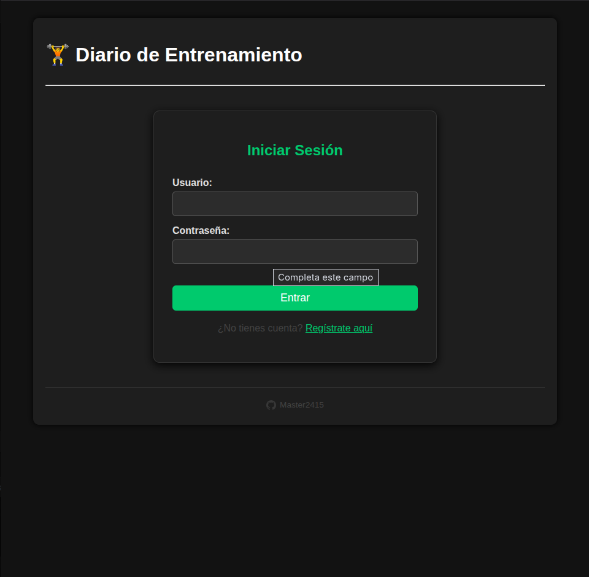 |

### 🏠 Dashboard y Navegación

|                  Dashboard Principal                   |                Lista de Sesiones                |
| :----------------------------------------------------: | :---------------------------------------------: |
| 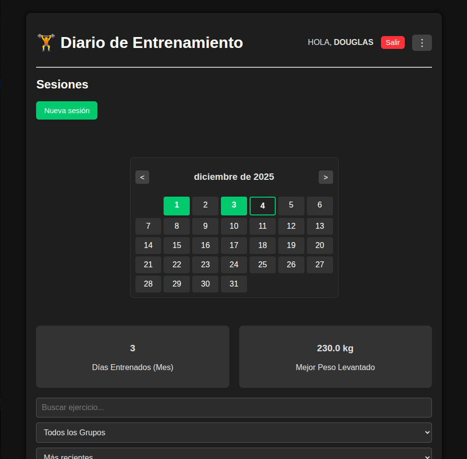 | 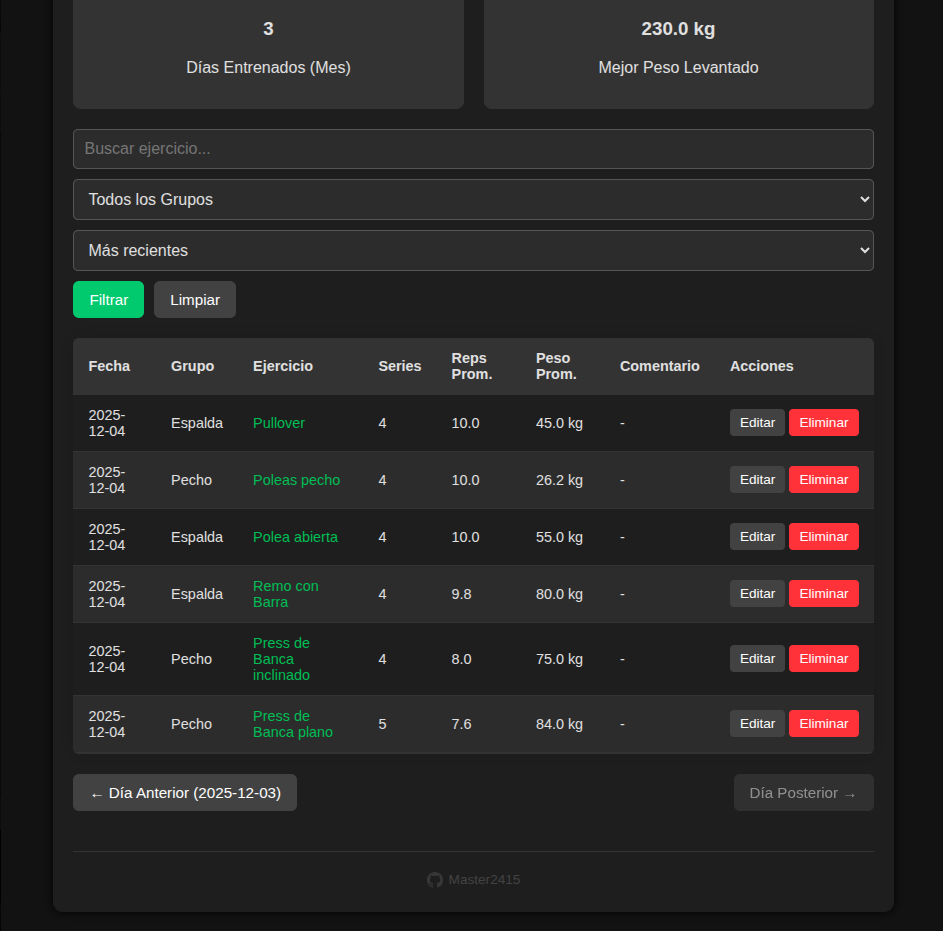 |

### 🏋️ Gestión de Entrenamientos

|                Gestión de Ejercicios                 |             Formulario Sesión (1)              |             Formulario Sesión (2)              |
| :--------------------------------------------------: | :--------------------------------------------: | :--------------------------------------------: |
| 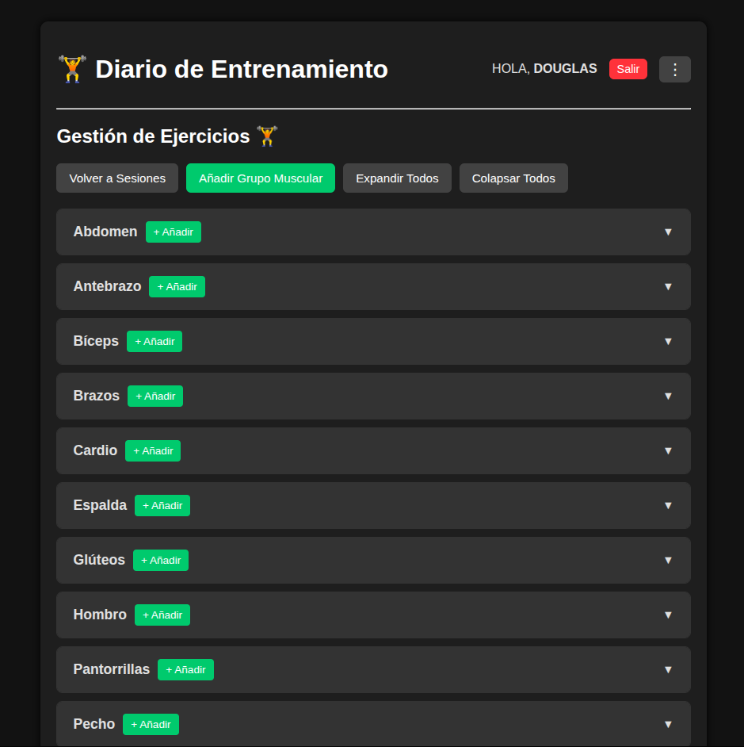 | 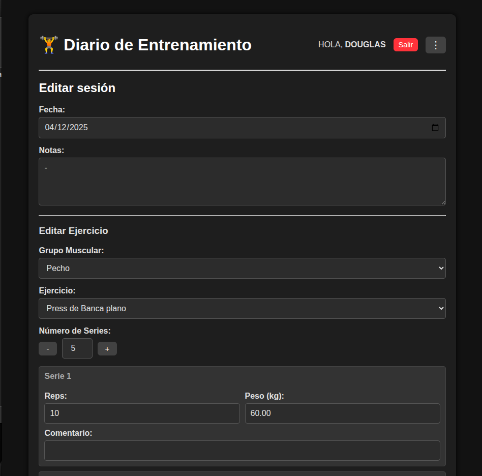 | 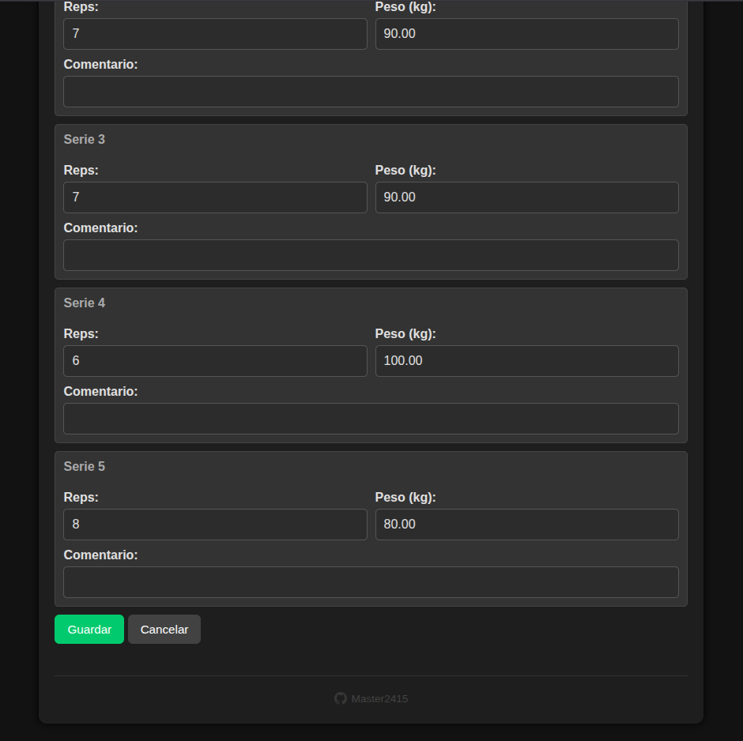 |

### 📈 Progreso y Estadísticas

|            Progreso (Oscuro)            |                Progreso (Claro)                 |
| :-------------------------------------: | :---------------------------------------------: |
| 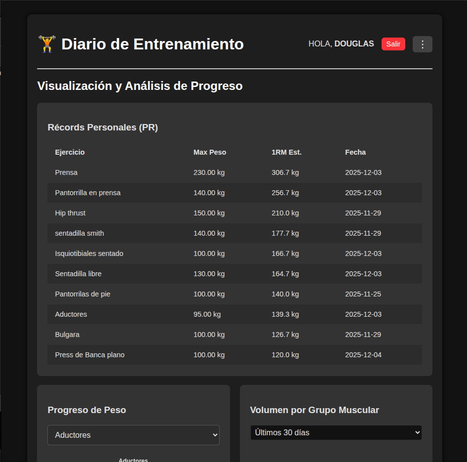 | 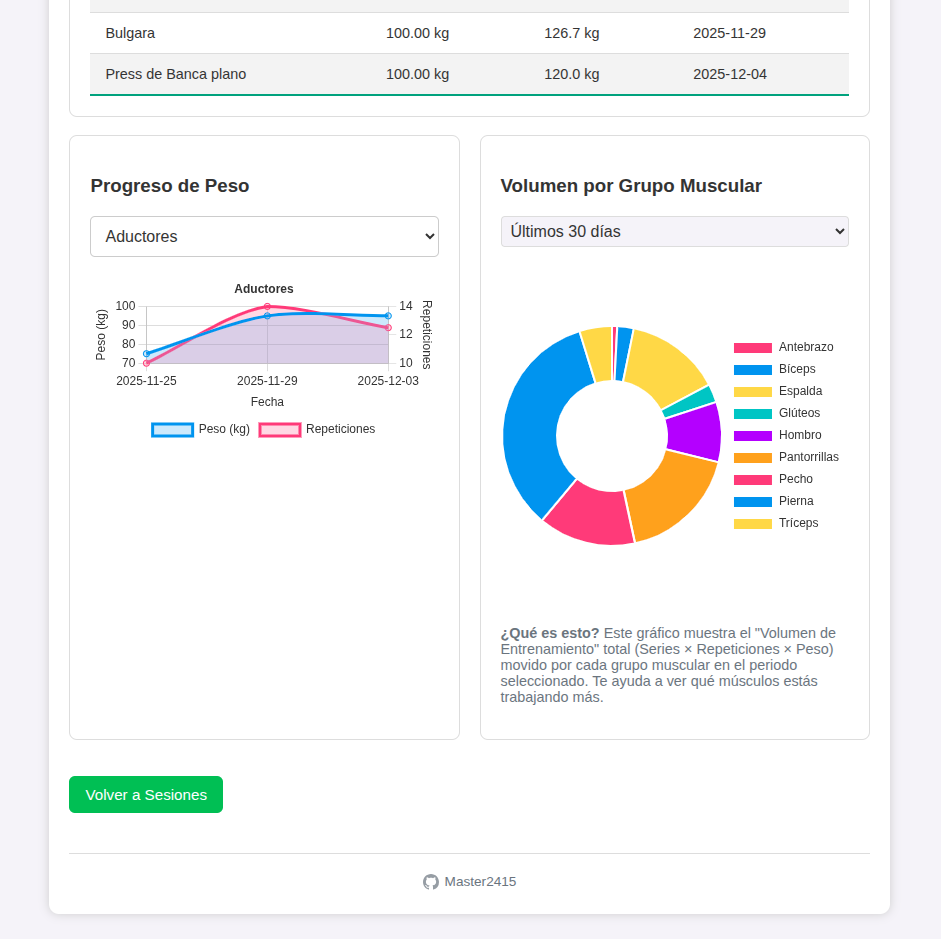 |

### 📏 Mediciones y Herramientas

|                 Calculadora y Mediciones                  |
| :-------------------------------------------------------: |
| 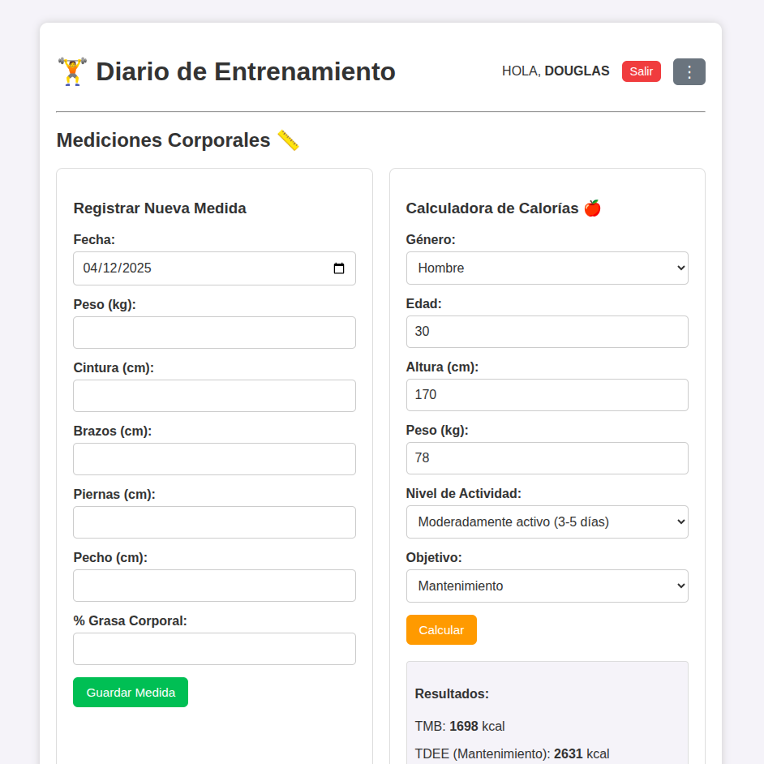 |

### ⚙️ Configuración

|               Configuración                |           Temas            |
| :----------------------------------------: | :------------------------: |
| 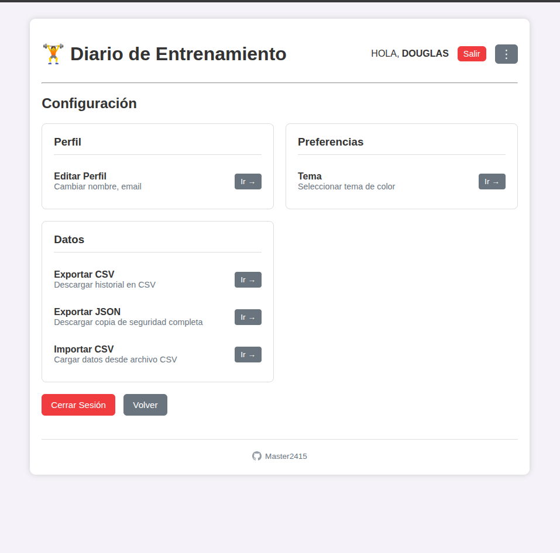 | 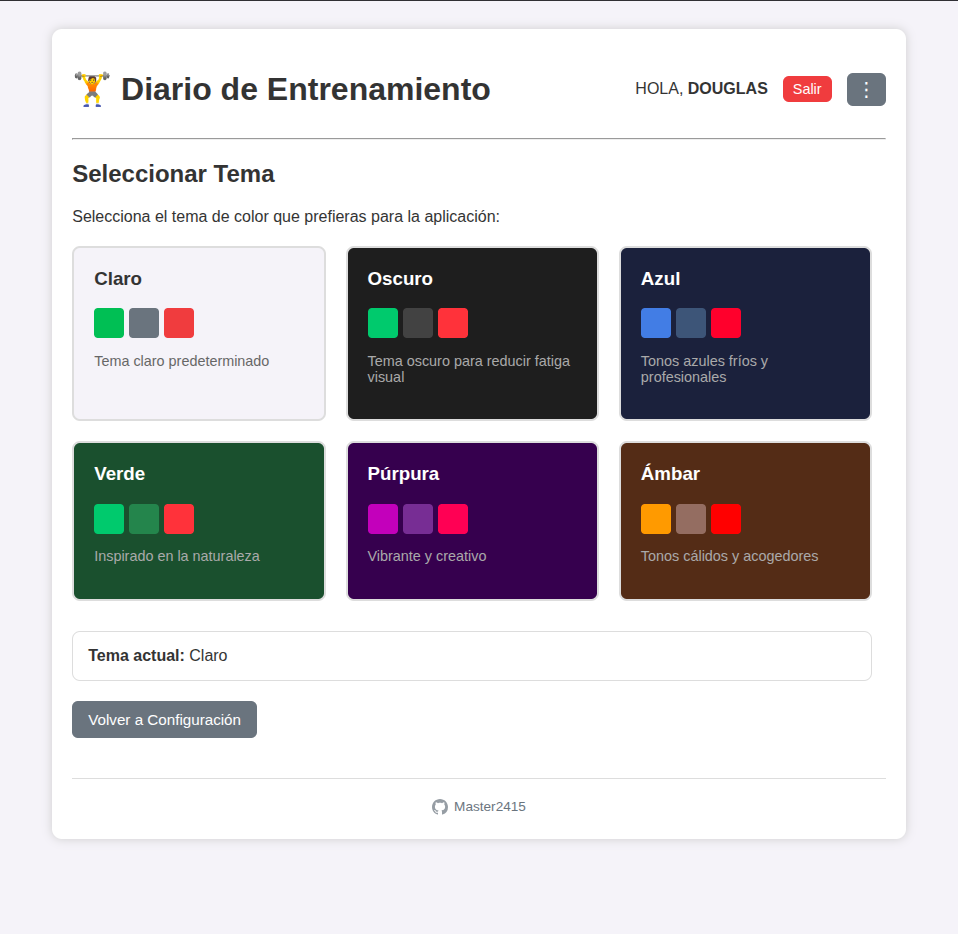 |

---

## 🛠️ Tecnologías

### Backend

- **Flask 3.0.0** - Framework web
- **Python 3.12** - Lenguaje de programación
- **SQLite/MySQL** - Base de datos

### Frontend

- **Jinja2** - Motor de plantillas
- **Vanilla CSS** - Estilos con variables CSS
- **Vanilla JavaScript** - Interactividad
- **Chart.js** - Gráficas y visualizaciones

### DevOps

- **Docker** - Containerización
- **Docker Compose** - Orquestación

---

## 📁 Estructura del Proyecto

```
gym-daily/
├── app/
│   ├── __init__.py          # Inicialización Flask
│   ├── db.py                # Conexión a base de datos
│   ├── utils.py             # Funciones auxiliares
│   ├── routes/              # Blueprints de rutas
│   │   ├── auth.py          # Autenticación
│   │   ├── workouts.py      # Entrenamientos
│   │   ├── analytics.py     # Análisis
│   │   └── export.py        # Exportación
│   ├── templates/           # Plantillas HTML
│   │   ├── base.html        # Template base
│   │   ├── workouts.html    # Lista de entrenamientos
│   │   ├── workout_form.html# Formulario
│   │   ├── analytics.html   # Gráficas
│   │   └── measurements.html# Mediciones
│   └── static/
│       └── style.css        # Estilos CSS
├── run.py                   # Punto de entrada
├── requirements.txt         # Dependencias Python
├── Dockerfile               # Imagen Docker
├── docker-compose.yml       # Orquestación
├── setup_windows.bat        # Setup Windows
├── run_windows.bat          # Ejecutar Windows
└── DEPLOYMENT.md            # Guía de despliegue
```

---

## 🤝 Contribuir

Las contribuciones son bienvenidas. Para contribuir:

1. **Fork** el proyecto
2. Crea una **rama** para tu feature (`git checkout -b feature/AmazingFeature`)
3. **Commit** tus cambios (`git commit -m 'Add some AmazingFeature'`)
4. **Push** a la rama (`git push origin feature/AmazingFeature`)
5. Abre un **Pull Request**

---

## 🐛 Reportar Problemas

Si encuentras algún bug o tienes sugerencias:

1. Verifica que no exista un issue similar
2. Crea un [nuevo issue](https://github.com/Master2415/gym_dialy/issues)
3. Describe el problema detalladamente
4. Incluye capturas de pantalla si es posible

---

## 📝 Roadmap

### Próximas Características

- [ ] PWA (Progressive Web App)
- [ ] Notificaciones de entrenamiento
- [ ] Plantillas de rutinas
- [ ] Compartir entrenamientos
- [ ] Soporte multi-idioma
- [ ] API REST
- [ ] Integración con wearables

---

## 📄 Licencia

Este proyecto está bajo la Licencia MIT. Ver el archivo `LICENSE` para más detalles.

---

## 👤 Autor

**Master2415**

- GitHub: [@Master2415](https://github.com/Master2415)
- Proyecto: [gym_dialy](https://github.com/Master2415/gym_dialy)

---

<div align="center">

**⭐ Si te gusta este proyecto, dale una estrella en GitHub ⭐**

[⬆ Volver arriba](#-gym-daily---diario-de-entrenamiento)

</div>
